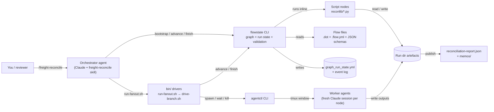
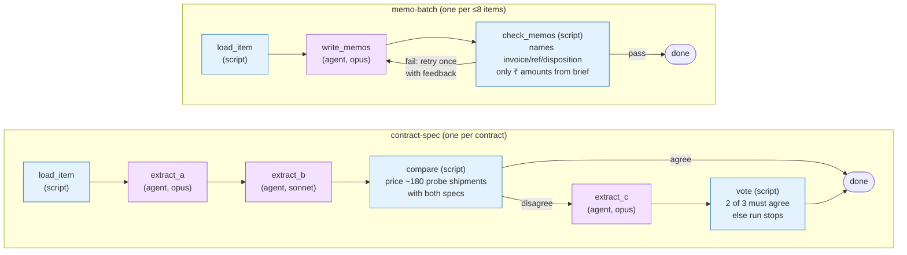
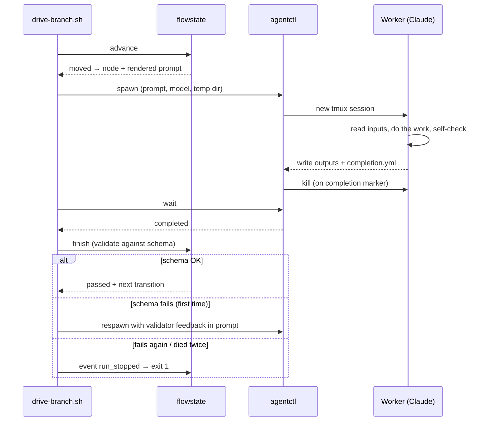

# Invoice reconciler

An agent system that reconciles carrier freight invoices and credit notes
against BlueFin's shipment records and rate contracts. It produces
[`reconciliation-report.json`](reconciliation-report.json) (conforming to
[`report.schema.json`](report.schema.json)) and a memo in [`memos/`](memos/)
for every item that isn't accepted.

It is built on a [flowstate](orchestrator/) graph driven by an orchestrator
skill. Deterministic scripts own every rupee figure; AI agents do only three
jobs: reading contract prose into rate specs, deciding rare open questions
within bounds set by rules, and writing memos. Code checks everything they
produce.

- **The task:** [PROBLEM.md](PROBLEM.md)
- **Design, validation, judgement calls, machinery changes, run history:** [DESIGN.md](DESIGN.md)
- **Orchestrator skill (entry point):** [.claude/skills/freight-reconcile/SKILL.md](.claude/skills/freight-reconcile/SKILL.md)
- **Submitted run:** `factory/graph_runs/freight-recon/recon-submission_*`

## Result (sample data)

| Lines | Accept | Dispute | Escalate | In dispute | Memos |
|---|---|---|---|---|---|
| 380 (17 documents) | 364 | 12 | 4 | ₹16,618.06 | 17 |

Every full run has produced this same summary.

## Running it

Prerequisites: python3, git, tmux, jq, and the Claude Code CLI (`claude`) on PATH.

```bash
orchestrator/setup.sh          # once: creates the venv for the flowstate/agentctl CLIs
```

Then, in Claude Code at the repo root, run `/freight-reconcile`. The skill
bootstraps the flow, drives it (fanouts go through
`factory/flows/freight-recon/bin/run-fanout.sh`), and publishes the report
and memos to the repo root. Optional variables at bootstrap:
`invoices_dir`, `shipments_path`, `contracts_dir`, `publish_dir`, and
`use_spec_cache=no` to force fresh contract extraction.

Tests:

```bash
orchestrator/.venv/bin/python -m unittest discover -s factory/flows/freight-recon/tests
orchestrator/.venv/bin/python -m unittest discover -s orchestrator/tests
```

## How it works

Blue boxes are deterministic scripts; purple boxes are AI agents.

### 1. Who does what



### 2. Main pipeline (`freight-recon`)

```mermaid
flowchart TD
    start([start]) --> ingest["ingest (script)<br/>parse 17 docs → 380 lines<br/>refuse on anything unparsed"]
    ingest --> match["match (script)<br/>exact ref → shipment<br/>fact conflicts + near-miss hints"]
    match --> plan["plan_contracts (script)<br/>carrier ↔ contract<br/>spec cache lookup"]

    plan -->|"extract_count == 0<br/>(all cached)"| check
    plan -->|"extract_count > 0"| sfan{{"specs_fanout<br/>dynamic_fanout"}}
    sfan --> sbr[["spec_branch<br/>subflow: contract-spec<br/>×1 per carrier"]]
    sbr --> sjoin(("specs_join<br/>reducer → rate-specs.json"))
    sjoin --> check["check_specs (script)<br/>every carrier has a valid spec<br/>store in cache"]

    check --> price["price (script)<br/>spec × shipment → expected<br/>named rule per disposition"]
    price -->|"review_count == 0"| assemble
    price -->|"review_count > 0"| adj["adjudicate (agent)<br/>pick among allowed<br/>dispositions only"]
    adj --> assemble["assemble (script)<br/>build report<br/>invariants I1–I9 or refuse"]

    assemble --> pmemo["plan_memos (script)<br/>batch non-accept items<br/>briefs with allowed ₹ amounts"]
    pmemo -->|"memo_item_count == 0"| publish
    pmemo -->|"memo_item_count > 0"| mfan{{"memos_fanout<br/>dynamic_fanout"}}
    mfan --> mbr[["memo_branch<br/>subflow: memo-batch<br/>×1 per batch"]]
    mbr --> mjoin(("memos_join<br/>reducer: batch count"))
    mjoin --> publish["publish (script)<br/>memo set == non-accept items<br/>copy + sha256 manifest"]
    publish --> done([done])

    classDef agent fill:#f4e1ff,stroke:#8a4fbf
    classDef script fill:#e3f2fd,stroke:#1e6fb8
    class adj agent
    class ingest,match,plan,check,price,assemble,pmemo,publish script
```



### 3. Child flows



### 4. One agent node, start to finish



## Repository layout

| Path | What |
|---|---|
| `data/` | Input: shipments, contracts, invoices (as provided) |
| `.claude/skills/freight-reconcile/` | Orchestrator skill: domain rules and failure policy |
| `factory/flows/freight-recon/` | Main flow: DOT + YAML, schemas, prompts, scripts, `bin/` drivers, `reconlib/`, tests |
| `factory/flows/contract-spec/` | Child flow: contract → agreed rate spec |
| `factory/flows/memo-batch/` | Child flow: batch of items → checked memos |
| `factory/graph_runs/` | Run evidence: state files, event logs, artefacts, branch logs |
| `orchestrator/` | flowstate + agentctl (kit machinery, with the fixes described in DESIGN.md) and their regression tests |
